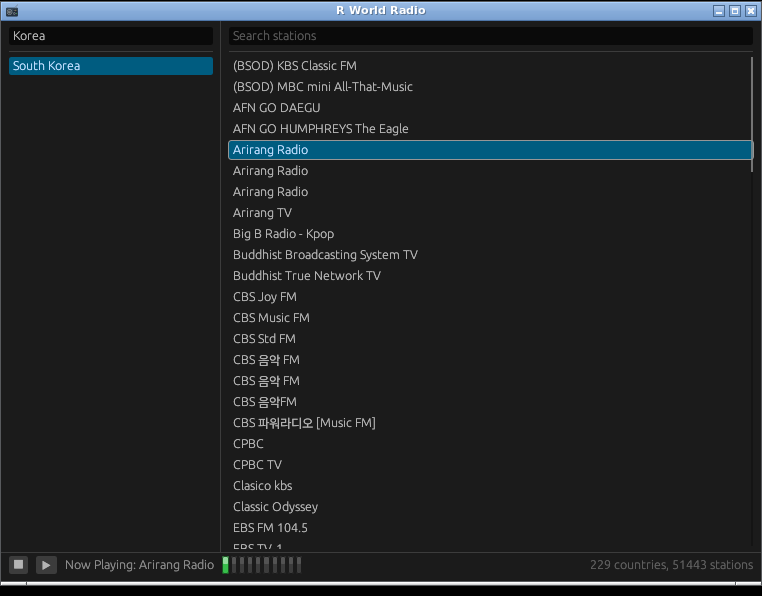

# R World Radio

*[한국어 버전](README.ko.md)*



Internet radio player for Linux desktops. Pick a country, pick a station, it
plays - about 51,000 stations across 229 countries, from a station list that ships
with the app. Nothing is contacted over the network except the station you chose
to listen to.

Built and tested on Linux Mint XFCE (x86_64).

## Requirements

- **Rust 1.88 or newer.** Mint/Debian's packaged `rustc` is too old, so install it
  through [rustup](https://rustup.rs):

  ```
  curl --proto '=https' --tlsv1.2 -sSf https://sh.rustup.rs | sh
  ```

- Build packages:

  ```
  sudo apt install build-essential pkg-config libasound2-dev
  ```

- An X11 or XWayland session with OpenGL, which any Mint XFCE install already has.
- For Japanese, Chinese and Korean station names to show as text rather than
  boxes: `sudo apt install fonts-noto-cjk`

## Building

```
cargo run --release
```

On a machine with 2 cores and ~4GB of RAM the link step can run out of memory. If
the build thrashes or gets killed, build without link-time optimization - the
binary is slightly larger and that is the only difference:

```
CARGO_PROFILE_RELEASE_LTO=false CARGO_BUILD_JOBS=2 nice cargo build --release
```

## Installing

```
./install.sh              # per-user, no root needed
./install.sh --system     # /usr/local, needs root
./install.sh --uninstall  # add --system if that is how it was installed
```

It appears in the applications menu under **Multimedia**, with no logout or reboot
needed.

A per-user install writes to:

```
~/.local/bin/rworldradio
~/.local/share/rworldradio/data/                  the station list
~/.local/share/applications/rworldradio.desktop
~/.local/share/icons/hicolor/<size>/apps/rworldradio.png
```

The station list is copied rather than linked, so the installed app keeps working
if this directory is moved or deleted. `--uninstall` removes all of the above.

If `~/.local/bin` is not on your `PATH`, the menu entry still works - it uses an
absolute path - but the `rworldradio` command from a shell will not. Add it with:

```
export PATH="$HOME/.local/bin:$PATH"
```

## Using it

- Type in either search box to filter. With 229 countries and ~51,000 stations,
  search is how you get around.
- Click a country, then double-click a station to play it - or select one and press
  the ▶ button.
- The ■ button appears only while something is playing.
- The LED bar shows the level of the audio actually playing.
- Hover a station to see its codec, bitrate, language, location and stream URL.
- Hover the status text on the right to see which station list is loaded and from
  where.

## Keeping the station list current

```
python3 tools/update_stations_db.py
```

Fetches radio-browser's catalogue and rewrites `data/countries.json` and every
`data/countries/<slug>.json`. Needs internet access. Re-run `./install.sh`
afterwards to copy the refreshed list into place.

The app itself never does this - it only reads the list that shipped with it.

## When a station will not play

Stations come and go, and a fair number of entries in any public directory are
dead. Two tools tell you which side the problem is on:

```
cargo run --release --example probe_stream -- "BBC Radio 4" 5   # no audio device used
cargo run --release --example play_stream  -- "BBC Radio 4" 8   # plays through ALSA
```

Both accept a station name (or part of one), or a URL directly.

- `probe_stream` fails → the station is dead, blocked in your region, or in a
  format that is not supported. The message says which.
- `probe_stream` works but `play_stream` does not → the problem is audio output,
  not the station. Check that PulseAudio or PipeWire is running.
- Both work but the app is silent → check the volume and which output device your
  desktop has selected.

## What is not supported

- **HE-AAC / AAC+ stations play, but sound duller than they should.** Only the core
  layer is decoded, so the high frequencies are missing and the sample rate is
  typically half the nominal one.
- **Opus streams do not play.** Ogg/Vorbis does.
- **Encrypted HLS streams (`#EXT-X-KEY`) and fragmented MP4/CMAF segments do not
  play.**
- A few stations refuse connections from anything that does not look like a
  browser, or are restricted to their own country.

## Station list source

- [radio-browser](https://www.radio-browser.info/)

## License

MIT - see [LICENSE](LICENSE).
